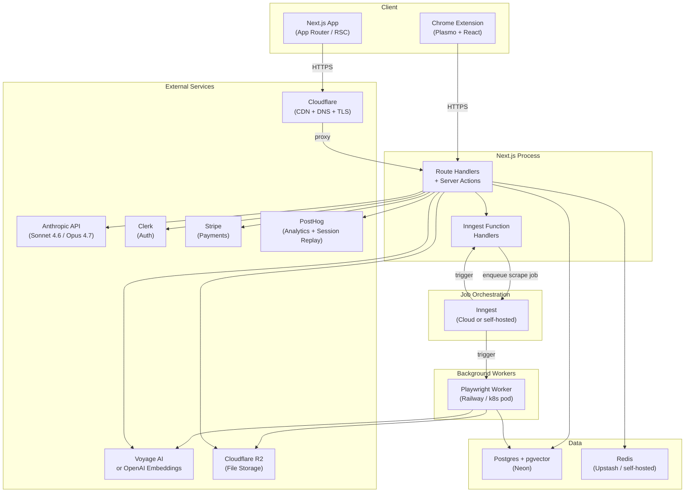

# Mirror — Architecture

**Status:** Accepted as of Wk 0. All Wk 1+ implementation decisions must be consistent with this document. Deviations require a new ADR.

---

## 1. System Overview

Mirror is a personalized LinkedIn profile rewriter that builds a deep Voice Card for each user — drawn from a conversational interview, uploaded AI chat history, and a scraped or imported LinkedIn snapshot — then uses Claude to produce a new profile grounded in that voice and benchmarked against a curated corpus of top-performing public profiles. The system is intentionally a single-product, single-team monorepo: one Next.js application with colocated route handlers, one Playwright worker for scraping, one Postgres database (Neon with pgvector), Redis for the Inngest event bus and rate-limiting, and a Plasmo Chrome extension that closes the last mile by assisting the user in writing changes directly into LinkedIn's edit UI.



---

## 2. Domain Model

The nine tables map onto three bounded contexts that reflect how value flows through the product.

**Identity context** — who the user actually is.
**Generation context** — what Mirror produces and whether the user accepts it.
**Outcomes context** — whether the profile change worked.

The `benchmark_profiles` table sits outside both as a shared corpus; it is written by the Playwright worker and read by the generation pipeline.

```mermaid
erDiagram
    users {
        uuid id PK
        text clerk_id UK
        text email
        text plan
        uuid voice_profile_id FK
    }

    interviews {
        uuid id PK
        uuid user_id FK
        jsonb transcript
        text summary
        timestamptz completed_at
    }

    imports {
        uuid id PK
        uuid user_id FK
        text source
        text raw_path
        jsonb parsed
        vector_3072 voice_embedding
    }

    linkedin_snapshots {
        uuid id PK
        uuid user_id FK
        text raw_html
        jsonb parsed
        timestamptz captured_at
    }

    generations {
        uuid id PK
        uuid user_id FK
        uuid input_snapshot_id FK
        jsonb output
        jsonb rationale
        text model
        text prompt_hash
        timestamptz created_at
    }

    commits {
        uuid id PK
        uuid user_id FK
        uuid generation_id FK
        jsonb fields_accepted
        timestamptz committed_at
        text method
    }

    outcomes {
        uuid id PK
        uuid user_id FK
        date week_of
        int profile_views
        int search_appearances
        int recruiter_msgs
        int post_impressions
        text source
    }

    benchmark_profiles {
        uuid id PK
        text industry
        text role
        text seniority
        text public_url
        jsonb parsed
        vector_3072 embedding
        jsonb performance_signals
    }

    outcome_deltas {
        uuid id PK
        uuid user_id FK
        uuid generation_id FK
        jsonb baseline_30d
        jsonb after_30d
        numeric lift_pct
    }

    llm_spend_ledger {
        uuid id PK
        uuid user_id FK
        uuid generation_id FK
        text model
        int input_tokens
        int output_tokens
        numeric cost_usd
        timestamptz recorded_at
    }

    users ||--o{ interviews : "has"
    users ||--o{ imports : "has"
    users ||--o{ linkedin_snapshots : "has"
    users ||--o{ generations : "has"
    users ||--o{ commits : "has"
    users ||--o{ outcomes : "has"
    users ||--o{ outcome_deltas : "has"
    users ||--o{ llm_spend_ledger : "has"
    linkedin_snapshots ||--o{ generations : "input for"
    generations ||--o| commits : "accepted as"
    generations ||--o{ outcome_deltas : "measured by"
    generations ||--o{ llm_spend_ledger : "recorded in"
```



### Relationship notes

- `users.voice_profile_id` is a synthetic FK pointing to the most recently completed `imports` row for that user. The Voice Card is derived from `imports.parsed` at query time, not denormalized.
- `generations.input_snapshot_id` references `linkedin_snapshots` so every generation is fully reproducible: we know exactly which scraped profile was the input.
- `generations.prompt_hash` is the SHA-256 of the serialized prompt (system + user messages after variable substitution). Cache hits within 24 hours short-circuit the LLM call entirely.
- `benchmark_profiles.embedding` is computed once by the worker and never updated in-place; workers insert new rows and a background Inngest job marks stale rows for re-embedding when the embedding model changes.
- `llm_spend_ledger` is not in the original spec table list but is required by §8 (LLM cost control). It is the source of truth for the `/admin/costs` page and the monthly cap check.

---

## 3. Architecture Decision Records

### ADR-001: ORM — Drizzle ORM (not Prisma)

**Status:** Accepted

**Context:**
The spec mandates Drizzle (§2). This ADR documents the rationale and the trade-offs the team accepts.

Drizzle is a TypeScript-first ORM that generates plain SQL with no runtime query engine. Prisma wraps queries in a binary engine process (the Query Engine), which complicates Docker images, cold-start latency (relevant on Neon autosuspend), and edge deployments. Both support Postgres; only Drizzle has first-class pgvector column type support without a raw SQL escape hatch, which is essential for the `vector(3072)` columns on `imports` and `benchmark_profiles`.

**Decision:**
Use Drizzle ORM for all database access. Schema lives in `src/db/schema.ts`. Migrations are managed by `drizzle-kit` and run as part of the container start sequence in `docker-compose.yml` and as a Kubernetes init container.

**Consequences:**
- Easier: SQL is transparent, performant, and reviewable. pgvector `<=>` (cosine), `<#>` (inner product), and `<->` (L2) operators are first-class. Schema changes are explicit SQL files, not magic diffs.
- Harder: No Prisma Studio equivalent for quick data browsing. The join API is more verbose than Prisma's nested include. The team must write explicit transactions rather than relying on Prisma's transaction API.
- Accepted risk: Drizzle is newer than Prisma; its ecosystem (plugins, community recipes) is smaller. Mitigated by the fact that our use of Drizzle is focused on a narrow surface area.

---

### ADR-002: Job Queue — Inngest (not BullMQ)

**Status:** Accepted

**Context:**
The spec mandates Inngest (§2). This ADR documents the trade-offs.

Long-running jobs — LinkedIn scraping (30–90 seconds with Playwright), benchmark corpus collection, embedding pipeline runs, weekly outcome digest emails — cannot be handled in a Next.js route handler due to serverless timeout constraints and the need for retries with backoff. The two realistic options at this stack size are Inngest and BullMQ.

BullMQ is a Redis-based queue with a mature ecosystem. It runs entirely in process, scales horizontally, and has excellent observability primitives. It requires the team to operate a Redis instance and write their own retry/backoff/dead-letter logic or adopt Bull Board for a UI.

Inngest treats functions as durable, resumable units of work that run in response to typed events. It provides automatic retries, step-level persistence (functions can sleep for hours and resume), a local dev server that replaces the need for a running Redis queue in dev, and a built-in UI for replay and debugging. The free tier (50k runs/month) covers pre-launch entirely.

**Decision:**
Use Inngest for all background job orchestration. Inngest functions live in `src/inngest/` and are registered with the Next.js route handler at `/api/inngest`. The local `docker-compose.yml` runs the Inngest dev server as a service. In production the Next.js app exposes the same endpoint and Inngest Cloud invokes it.

**Consequences:**
- Easier: Zero queue infrastructure to operate in dev. Step-level retries mean the scraper can retry the Playwright call without re-queuing the entire job. The Inngest dashboard provides full event history and replay — critical for debugging scrape failures.
- Harder: Inngest Cloud is a third-party dependency with its own pricing above 50k runs/month. Self-hosting Inngest on k3s is possible but adds an extra Helm chart. BullMQ would have been purely self-hosted.
- Accepted risk: Inngest's local dev server has occasionally lagged behind the cloud API; pin the `inngest` package version in `package.json` and test locally before upgrades.

---

### ADR-003: Repository Structure — Single-Package Monorepo

**Status:** Accepted

**Context:**
The spec does not prescribe monorepo tooling. The deliverables include a Next.js app, a Playwright worker, a Chrome extension (Plasmo), Helm charts, Terraform, and a test suite. This could be structured as:

- A polyrepo (separate repositories per deliverable)
- A multi-package monorepo (pnpm workspaces, Turborepo)
- A single-package monorepo (one `package.json`, co-located by directory convention)

At the current team size (one engineer) and product stage (pre-launch), the overhead of multi-package workspace tooling — separate `package.json` files, inter-package dependency graphs, cache invalidation tuning — is not justified. The Playwright worker shares types and utility functions with the Next.js app; duplicating them across packages introduces drift.

The Chrome extension is built by Plasmo separately into `extension/dist/` from source in `extension/src/`; it does not need to be a pnpm workspace package to share types. Types can be referenced via TypeScript path aliases or a `tsconfig` project reference.

**Decision:**
Use a single-package monorepo: one root `package.json`, one `tsconfig.json`, one `vitest.config.ts`. Directories are:

```
src/                    # Next.js app (App Router)
  app/                  # Routes, layouts, pages
  components/           # React components
  db/                   # Drizzle schema + client
  inngest/              # Inngest functions
  lib/                  # Shared business logic
    crypto/
    parsers/
    prompts/
    rag/
    voice/
extension/              # Chrome extension (Plasmo)
  src/
  dist/                 # Build output (gitignored)
worker/                 # Playwright scraper entry point
infra/                  # Helm, Terraform
tests/                  # All test types (Vitest + Playwright)
evals/                  # promptfoo eval configs
fixtures/               # Test fixtures
```

**Consequences:**
- Easier: One `pnpm install`, one CI lint/typecheck pass, shared types between `src/` and `worker/` without package boundaries. Simpler for a solo/small team to reason about.
- Harder: As the team grows and the Chrome extension matures, the lack of workspace isolation may cause accidental coupling. The migration path to pnpm workspaces is straightforward — promote directories to packages — but it is a refactor.
- Accepted risk: The `extension/` directory uses Plasmo's own build toolchain; it may drift from the root `tsconfig.json`. Use `tsconfig.json` path references and test with `tsc --build` on the extension target in CI.

---

### ADR-004: Embedding Model — Voyage AI `voyage-large-2` as Default

**Status:** Accepted

**Context:**
The spec lists two options (§2): Voyage AI and OpenAI `text-embedding-3-large`. Both produce 3072-dimensional vectors (or can be configured to). The choice affects retrieval quality, cost, and free-tier availability.

`text-embedding-3-large` at 3072 dimensions costs $0.13/1M tokens. Voyage AI's `voyage-large-2` costs $0.12/1M tokens and outperforms `text-embedding-3-large` on the MTEB benchmark for domain-specific semantic retrieval, particularly for professional text (which is heavily abbreviated, acronym-dense, and role-specific). Voyage AI's free tier offers 50M tokens/month — sufficient to embed the full 5,000-profile benchmark corpus (~2.5M tokens) at zero cost pre-launch.

`text-embedding-3-small` is an alternative at $0.02/1M tokens and 1536 dimensions. The dimension reduction would require migrating the `vector(3072)` column and re-embedding all stored vectors, which is an expensive operation at scale. Starting at 3072 dimensions preserves optionality.

**Decision:**
Default to Voyage AI `voyage-large-2` at 3072 dimensions. The embedding provider is abstracted behind `src/lib/embeddings/index.ts` with a `EMBEDDING_PROVIDER` env var (`voyage` | `openai`) so the team can switch without changing call sites. Both providers are tested with `EMBEDDING_PROVIDER=openai` in the integration test suite to ensure the abstraction does not leak.

**Consequences:**
- Easier: Lower cost in production, better retrieval quality for professional text, free tier covers the seeding phase entirely.
- Harder: Voyage AI is a smaller vendor than OpenAI; API availability risk is higher. The env-var abstraction mitigates this: if Voyage has an outage, flipping to OpenAI requires one env var change and a re-index of stored embeddings.
- Accepted risk: Voyage AI's API may change or the company may be acquired. The abstraction layer is the mitigation; document the re-embedding procedure in `DEPLOY.md`.

---

### ADR-005: pgvector Index Strategy — HNSW for `benchmark_profiles`, IVFFlat for `imports`

**Status:** Accepted

**Context:**
The spec requires k-NN retrieval at 5,000–50,000 benchmark profile scale with sub-200ms latency (§7, Wk 4 integration test). Postgres pgvector offers two index types for approximate nearest neighbour search:

**IVFFlat** partitions the vector space into `lists` Voronoi cells and searches `probes` cells at query time. Build time is fast. Recall degrades as the dataset grows unless `lists` is re-tuned. Best for static datasets with infrequent bulk inserts.

**HNSW** (Hierarchical Navigable Small World) builds a multilayer proximity graph. Query time is O(log n). Recall is higher than IVFFlat at equivalent query latency. Build time is slower and memory footprint is larger (`m` bidirectional links per node × `ef_construction` build buffer). HNSW does not require a vacuum-like maintenance step; it handles incremental inserts without rebuild.

At 3072 dimensions:
- 5k profiles × 3072 dims × 4 bytes = ~60 MB of raw vectors — fits easily in Postgres shared buffers.
- 50k profiles — ~600 MB; still manageable on a single Neon instance.
- HNSW `m=16, ef_construction=64` gives >95% recall at these scales with query latency well under 200ms on a warmed buffer cache.

The `imports.voice_embedding` column stores one vector per import per user. The dataset is small (bounded by user count) and queries are always filtered by `user_id` first, so a partial IVFFlat index on `(user_id)` WHERE clause or a simple sequential scan is sufficient and cheaper to build.

**Decision:**

```sql
-- benchmark_profiles: HNSW, cosine distance
CREATE INDEX benchmark_profiles_embedding_hnsw_idx
ON benchmark_profiles
USING hnsw (embedding vector_cosine_ops)
WITH (m = 16, ef_construction = 64);

-- At query time, set ef_search higher for better recall:
SET hnsw.ef_search = 100;

-- imports: no dedicated ANN index; filter by user_id first,
-- then cosine similarity on the small result set.
-- Add a standard btree index on user_id for the filter:
CREATE INDEX imports_user_id_idx ON imports (user_id);
```

Index tuning parameters are recorded here and in the Drizzle migration file. The Database Optimizer agent must re-validate `ef_search` and `m` values once the corpus reaches 10k and 50k profiles; add a Wk 4 task to run `EXPLAIN (ANALYZE, BUFFERS)` and check `Index Cond` hit rate.

**Consequences:**
- Easier: HNSW delivers consistent sub-100ms retrieval at 5k–50k scale without periodic IVFFlat rebalancing. Incremental inserts from the worker do not degrade the index.
- Harder: HNSW index build takes longer (~2–5 minutes for 50k vectors at 3072 dims on a small Neon instance). Schedule index builds during off-peak hours in the migration. HNSW memory overhead is approximately `2 * m * n * 8 bytes` ≈ 12.8 MB at 50k vectors with `m=16` — negligible.
- Neon note: Neon's autosuspend (free tier, 5-minute idle) will unload the HNSW graph from shared buffers. The first query after a cold start will be slow (~300ms buffer warm-up). Add a single retry with 500ms delay in the retrieval function and document this in `values-freetier.yaml` config notes.

---

### ADR-006: Playwright Scraper Isolation — Dedicated Railway Worker (or Kubernetes Pod)

**Status:** Accepted

**Context:**
LinkedIn session-cookie scraping with Playwright requires a full Chromium browser process. Running this in-process inside the Next.js app has three problems: (1) the Playwright/Chromium binary inflates the web image from ~80 MB to ~600 MB, violating the 250 MB image budget; (2) a crashing browser process can take down the web server; (3) Vercel's serverless environment does not support Playwright at all, breaking deployment path (a).

The alternatives are:
- **In-process in the Next.js app** — eliminated for the reasons above.
- **Sidecar container** — a separate container in the same Kubernetes pod. Shares the pod network but requires Kubernetes. Breaks docker-compose portability because sidecars are a k8s concept; in compose they become separate services anyway.
- **Separate worker service** — a standalone process that polls Inngest for scrape jobs. Runs as `Dockerfile.worker` in docker-compose and as `mirror-worker` Deployment in Helm. Scales independently.

The separate worker is the only option that satisfies all four deployment paths.

**Decision:**
Build `Dockerfile.worker` based on `mcr.microsoft.com/playwright:v1.x-jammy`. The worker runs as an Inngest function host: it registers its functions at startup and Inngest invokes them via HTTP. The worker receives encrypted cookie and target URL as job payload, runs the Playwright scrape, writes the result to Postgres, and uploads raw HTML to Cloudflare R2. It never holds the session cookie in memory longer than the duration of the scrape.

In Railway (path a), deploy as a Railway service from `Dockerfile.worker`. In docker-compose (path b), it is the `worker` service. In Kubernetes (paths c and d), it is the `mirror-worker` Helm chart with KEDA scale-to-zero on idle.

**Consequences:**
- Easier: Web image stays under 250 MB. A failing scrape job does not affect the web tier. The worker can be independently scaled or restarted. The Chrome extension's commit-assist path does not need the worker at all (it runs client-side Plasmo code), so the worker can be at zero replicas when not scraping.
- Harder: Two Docker images to build and push. Inngest must be reachable from the worker; in local dev the Inngest dev server bridges this. Worker cold-start on Railway or scale-to-zero k8s pod adds ~10–30 seconds to scrape initiation — acceptable because scraping is already a 30–90 second operation.

---

### ADR-007: Chrome Extension Framework — Plasmo

**Status:** Accepted

**Context:**
The spec mandates Plasmo (§2, §1.3, §1.4). This ADR confirms the decision and documents the framework choices within Plasmo.

Plasmo is a framework for building Chrome (and Firefox) extensions with React and TypeScript. It handles manifest generation, content script injection, background service worker setup, and HMR during development. The alternatives are WXT (a newer Vite-based framework) and a manual webpack/vite setup.

WXT has a cleaner Vite integration and is gaining adoption, but Plasmo has better-documented patterns for content script React rendering and the `@plasmohq/storage` and `@plasmohq/messaging` libraries are a good match for the use case: reading the LinkedIn DOM from a content script and communicating accepted-field changes back to the background service worker.

A manual setup offers maximum control but adds significant boilerplate that would need to be maintained. At MVP scope this is not justified.

**Decision:**
Use Plasmo as specified. Extension source lives in `extension/src/`. The content script targets `linkedin.com/in/*` and `linkedin.com/in/*/edit`. Key Plasmo features in use:

- `contents/` — content scripts for DOM reading (Voice Match badge) and commit-assist (filling edit fields)
- `popup/` — extension popup for status and quick actions
- `background/` — service worker for API calls back to the Mirror app (avoids CORS on content scripts)
- `@plasmohq/messaging` — typed message passing between content ↔ background ↔ popup
- `@plasmohq/storage` — persisting auth token and last-seen generation ID locally

The extension shares TypeScript types with `src/` via a symlinked or path-referenced `types/` directory. The Plasmo build output at `extension/dist/` is gitignored; CI builds it from source.

**Consequences:**
- Easier: Declarative manifest, React in content scripts, built-in HMR. The Plasmo community has solved most LinkedIn DOM-injection edge cases already.
- Harder: Plasmo's release cadence can be unpredictable; pin the version. The extension cannot use the same Next.js App Router environment as the web app — any shared logic must live in `src/lib/` as pure TypeScript, not in Next.js-specific modules.
- Accepted risk: Chrome Manifest V3 service worker lifetime limits (30 seconds). Long operations (outcome capture, batch field commits) must be broken into message-passing steps so the service worker can be re-awakened. The commit-assist flow is already designed this way.

---

### ADR-008: LLM Cost Control — Prompt Hashing, 24h Generation Cache, Monthly Hard Cap

**Status:** Accepted

**Context:**
The spec (§8) requires: prompt hashing, embedding cache, 24h generation reuse, and a hard monthly cap keyed to `LLM_MONTHLY_CAP_USD` with a 402 response on breach. Without this, a Hacker News spike or a prompt-injection loop could exhaust the Anthropic budget in hours.

**Decision:**

**Prompt hashing and 24h generation cache:**
Before calling the LLM for generation, compute `prompt_hash = SHA-256(JSON.stringify({systemPrompt, userMessages, modelId}))`. Query `generations` for a row matching `(user_id, prompt_hash, created_at > NOW() - INTERVAL '24 hours')`. If found, return the cached output. This is transparent to the user — the walkthrough loads instantly. The hash must include the full serialized prompt, not just identifiers, so any prompt template change invalidates the cache correctly.

**Embedding cache:**
`imports.voice_embedding` stores the computed embedding for each import. Re-embedding is triggered only on re-import. `benchmark_profiles.embedding` is computed once at ingestion and stored. Never re-embed a row that already has a non-null embedding unless the model version changes (tracked by a `embedding_model` column on both tables).

**Monthly cap enforcement:**
Every Anthropic API call records the cost from the response's `usage` metadata to `llm_spend_ledger`. Before each generation call, query:

```sql
SELECT COALESCE(SUM(cost_usd), 0) AS mtd_spend
FROM llm_spend_ledger
WHERE recorded_at >= date_trunc('month', NOW());
```

If `mtd_spend >= LLM_MONTHLY_CAP_USD` (default `20`), the generation route returns HTTP 402 with body:

```json
{
  "error": "monthly_cap_reached",
  "message": "Mirror has reached this month's generation budget. Try again on [first of next month], or contact support to upgrade.",
  "resets_at": "<ISO 8601 date of first of next month>"
}
```

The cap check is also tested by mocking `llm_spend_ledger` above threshold in the unit test suite (`tests/unit/` cost-cap.spec.ts) and asserting the 402 response. The `/admin/costs` page displays MTD spend, per-model breakdown, and the cap threshold.

**Streaming:**
All interview and generation calls use the Anthropic streaming API. The cost from streaming responses is computed from `usage` in the final `message_stop` event and flushed to `llm_spend_ledger` after the stream closes. Do not attempt to estimate cost mid-stream.

**Consequences:**
- Easier: Budget predictability at any traffic level. 24h cache dramatically reduces cost for users who iterate on their walkthrough without changing their inputs.
- Harder: The cap creates a UX cliff: the app is fully functional until suddenly it is not. Mitigate by surfacing MTD spend on the `/admin/costs` page and adding a warning at 80% of cap. The 402 message must be friendly and actionable.
- Accepted risk: `llm_spend_ledger` writes on every API call add a small DB write on the hot path. At pre-launch scale this is negligible. At scale, batch writes with a 1-second flush interval if latency becomes an issue.

---

### ADR-009: GDPR Right-to-Erasure — Redaction-in-Place (Soft Delete), Not Hard Delete

**Status:** Accepted (2026-05-31, supersedes the cascade-delete sketch previously in §6)

**Context:**
GDPR Article 17 requires a code path that fully erases a user's personal data on request. The original `/settings/delete-account` sketch in §6 called `DELETE FROM users`, relying on `ON DELETE CASCADE` to fan the delete across every child table.

That sketch is incompatible with the audit schema. `audit_log.accessor_id` is `NOT NULL ON DELETE RESTRICT` (deliberately — an accessor's audit trail must outlive a soft-delete so we can answer "who looked at what"). PostgreSQL will refuse to hard-delete any user who has ever performed a PII read, which — once `src/lib/db/pii-read.ts` is wired — includes every active user, since users routinely read their own PII. A hard delete would raise `update or delete on table "users" violates foreign key constraint "audit_log_accessor_id_users_id_fk"` and the erasure flow would fail open.

Four options were considered (see issue #16):

1. **Nullify `accessor_id` on user delete** — `ON DELETE SET NULL`. Preserves the audit row, destroys attribution. Weakens SOC 2 / breach-investigation posture.
2. **Cascade audit rows** — `ON DELETE CASCADE`. Erases every PII-read record the user ever performed. Destroys exactly the data a regulator would subpoena. Unacceptable.
3. **Redaction in place ("soft delete")** — keep the `users.id` row, NULL/placeholder its PII columns (`email`, `clerk_id`), delete every child row that carries the user's content (interviews, imports, snapshots, generations, commits, outcomes, outcome_deltas, llm_spend_ledger). The `audit_log` FKs are never violated because the parent row survives.
4. **Hard-delete with audit-trail migration** — copy referenced audit rows to a separate `audit_log_archive` table with frozen accessor display strings, then drop the FK and `DELETE`. Most defensible to a regulator; most code surface; most ways to leave PII behind in the archive.

**Decision:**
Option 3. The user-facing contract — "delete everything" — is satisfied by *redaction* rather than row removal. The redacted row carries no personal data; it is an opaque identifier the audit log can keep pointing at to preserve the *who-did-what-when* trail that the threat model and SOC 2 alignment both require.

`src/lib/db/delete-user.ts` exposes a single `deleteUser(userId)` helper:

- Runs in a single transaction.
- Deletes every child row referenced via `users.id` cascade except `audit_log` (interviews, imports, linkedin_snapshots, generations, commits, outcomes, outcome_deltas, llm_spend_ledger). Cascade order is honoured implicitly because parents are deleted before parents-of-parents.
- `UPDATE users SET email = 'deleted+<id>@deleted.invalid', clerk_id = 'deleted:<id>', voice_profile_id = NULL, plan = 'deleted' WHERE id = <id>`. The `users.id` primary key is preserved; the `clerk_id` placeholder is unique by construction.
- `audit_log` rows are untouched. `audit_log.user_id` (the *subject* of a PII read) is `ON DELETE SET NULL` for the unlikely future case where a row is genuinely removed; the soft-delete path leaves the FK intact and relies on the PII columns on `users` being redacted.
- Idempotent — calling `deleteUser` on an already-redacted user is a no-op (the placeholder `clerk_id` and `email` already match).

The Clerk identity is revoked separately by the route handler (`clerk.users.deleteUser(clerkId)`), outside this transaction. That call is non-transactional with Postgres; the helper is the durable record of erasure regardless of Clerk-side success.

**Consequences:**
- Easier: The `audit_log.accessor_id RESTRICT` constraint stays, and with it the "every PII read is attributable to a non-deletable accessor" invariant the threat model relies on. The erasure flow is a single `UPDATE` + a handful of `DELETE`s in one transaction — small, reviewable, and testable against the real schema in CI.
- Harder: Anyone reading the schema must understand that `users` is *not* a list of real accounts — some rows are tombstones. Helper-level filters (e.g. a `where: notDeleted` Drizzle predicate) and a follow-up ESLint rule for `users.email`/`users.clerk_id` reads are deferred to the route-handler PR.
- Compliance posture: GDPR Article 17 is satisfied because the row carries no personal data after redaction (`users.id` alone is not personal data under Art. 4(1) — it is an internal identifier with no link to a natural person once email/clerk_id are gone). CCPA "right to delete" is satisfied on the same basis. This posture is documented in `COMPLIANCE.md` §2.5 and is reviewable by counsel before launch.
- Accepted risk: The `llm_spend_ledger` row count stays accurate (rows are deleted with the user), so MTD spend calculations are unaffected. Stripe transaction records remain on Stripe under their independent 7-year retention obligation, as noted in `COMPLIANCE.md` §2.5.
- Reversibility: If a regulator later insists on a true hard delete, Option 4 (audit-trail archive table) is still reachable from this state — the redacted `users` row can be archived to `audit_log_archive` along with referenced audit rows and then dropped. The current decision does not foreclose that.

---

## 4. Deployment Topology

The system must work on all four paths from §2.5. No path is a second-class citizen.

| Dimension | (a) Vercel + Neon + Railway | (b) docker-compose on VPS | (c) Helm on Kubernetes | (d) Free-tier: OCI + k3s |
|---|---|---|---|---|
| **Portability** | Low — Vercel-specific Next.js features (Edge Runtime, ISR) must be avoided | High — standard Docker | Highest — any k8s conformant cluster | High — real k8s on free infra |
| **Cost (pre-launch)** | ~$20–40/mo (Vercel Pro + Railway) | ~$10–20/mo (VPS) | Variable — EKS ~$70/mo, self-managed lower | ~$0–5/mo (only Anthropic spend) |
| **Ops burden** | Very low — no infra to manage | Low — one server, docker compose | High — cluster management, cert-manager, ArgoCD | Medium — k3s is simpler than full k8s; OCI ARM provisioned by Terraform |
| **Time to ship** | Hours | 1 day | 3–5 days (first time) | 1–2 days (Terraform + Helm) |
| **Scaling model** | Serverless auto-scale (web), Railway autoscale (worker) | Manual — scale the VPS or add nodes | HPA + KEDA; PDB prevents full downtime | Single-node k3s; scale-to-zero worker via KEDA `idleReplicaCount: 0` |
| **Best for** | Solo founder, fastest revenue path | Self-hosted, single-tenant, privacy-first | Multi-region, enterprise, HA | Portfolio piece, pre-launch, $0 ops |
| **Key constraint** | Playwright worker cannot run on Vercel serverless; Railway is mandatory for the worker | Requires manual TLS renewal unless Caddy is used as reverse proxy | Must provision cluster before deploying | Neon/Upstash cold-start latency; 24 GB RAM total across 4 ARM nodes |

### Free-tier resource allocation (path d)

The four Oracle Cloud ARM A1 VMs provide 24 GB RAM and 4 OCPUs total. Helm `values-freetier.yaml` allocates:

| Component | `requests.memory` | `requests.cpu` | Notes |
|---|---|---|---|
| mirror-web | 512Mi | 250m | `replicas: 1`, no HPA min > 1 |
| mirror-worker | 1Gi | 500m | KEDA `idleReplicaCount: 0`; scales to zero when idle |
| k3s system | ~512Mi | — | k3s is lighter than full k8s |
| Inngest (self-hosted) | 256Mi | 100m | Optional; default to Inngest Cloud free tier |
| Headroom | ~1Gi | — | For burst, OS, and log collection |

All Docker images must be published as `linux/amd64,linux/arm64` multi-arch manifests via `docker buildx` in CI. Verify the Playwright base image version supports `arm64` before pinning.

---

## 5. Component Responsibilities

**Next.js App (`src/app/`)** is the primary user-facing surface. It owns the App Router routes, React Server Components for the walkthrough and interview pages, Server Actions for form submissions (import upload, section accept/reject), and streaming route handlers for the interview chat and generation pipeline. It holds no long-running state; all stateful work is delegated to Inngest functions or handled in a single request-response cycle.

**Inngest Functions (`src/inngest/`)** are the durable work layer. They own: triggering the Playwright worker for LinkedIn scraping, running the embedding pipeline after an import is processed, orchestrating multi-step generation (fetch snapshot → retrieve benchmark exemplars → call Claude Opus → write generation row → notify client via polling or SSE), and dispatching weekly outcome digest emails. Steps within a function are individually retried on failure without replaying earlier steps.

**Playwright Worker (`worker/`)** is a separate Node.js process that registers Inngest functions for browser-driven tasks. It receives a scrape job, decrypts the session cookie in memory, launches a headless Chromium session, navigates to the LinkedIn profile, captures the DOM and key metrics, then writes the structured snapshot to Postgres and the raw HTML to R2. The cookie is never written to disk or logged. After the scrape, the key material is explicitly zeroed in memory.

**Drizzle Schema + Client (`src/db/`)** defines the database contract. The schema file is the single source of truth for table structure; Drizzle Kit generates migrations from it. The client is instantiated once as a module singleton and reused across request handlers. Never instantiate a new client per request.

**Voice Card Pipeline (`src/lib/voice/`)** transforms raw interview transcripts and parsed AI history imports into a structured Voice Card — vocabulary fingerprint, hedge patterns, sentence length distribution, emotional register, jargon blacklist. The Voice Card is the primary input to the generation prompt alongside the LinkedIn snapshot and benchmark exemplars.

**RAG Retrieval (`src/lib/rag/`)** takes a query embedding (derived from the user's Voice Card + target role) and returns the top-k benchmark profiles by cosine similarity from the HNSW index. The retrieved profiles are serialized into the generation prompt as exemplar context.

**Embedding Service (`src/lib/embeddings/`)** is a thin abstraction over Voyage AI and OpenAI embedding APIs. It checks `imports.voice_embedding IS NOT NULL` and `benchmark_profiles.embedding IS NOT NULL` before calling the API, enforcing the embedding cache. The provider is selected by the `EMBEDDING_PROVIDER` env var.

**Crypto (`src/lib/crypto/`)** wraps libsodium's `secretstream` (for the LinkedIn session cookie) and `crypto_generichash` (for prompt hashing). It is the only place in the codebase where raw key material is handled. Coverage requirement is 100% (per §7 CI gates). Tests are in `tests/unit/crypto/`.

**Chrome Extension (`extension/src/`)** runs as a Plasmo content script on `linkedin.com/in/*`. It reads the live profile DOM to display the Voice Match Score badge, and on `linkedin.com/in/*/edit` it provides the commit-assist flow: receiving accepted field values from the Mirror walkthrough and filling LinkedIn's edit fields one-by-one with user confirmation at each step. The extension communicates with the Mirror API via the background service worker to avoid CORS restrictions.

**`/admin/costs` Page** displays real-time MTD LLM spend from `llm_spend_ledger`, per-model breakdown, cap threshold, and days until reset. Restricted to users with `plan = 'admin'` by a Clerk `publicMetadata` role check in the middleware.

---

## 6. Security Posture Summary

The full threat model is in `THREAT_MODEL.md` (Security Engineer deliverable). The non-negotiables that every implementation PR must respect:

**LinkedIn session cookie handling:** The `li_at` cookie is the most sensitive credential in the system. It is encrypted with libsodium `secretstream` using a key derived from `COOKIE_ENCRYPTION_KEY` (a 32-byte random key stored in the environment, never in the database). The encrypted blob is stored in `linkedin_snapshots.session_cookie_encrypted`. The plaintext is decrypted only in the Playwright worker, in memory, for the duration of the scrape. It is never logged, never sent to a client, and never written to disk. The test in `tests/unit/crypto/cookie-crypto.spec.ts` enforces round-trip correctness, tamper detection, and nonce uniqueness.

**Audit log on PII reads:** Every read of `interviews.transcript`, `imports.raw_path`, `imports.parsed`, or `linkedin_snapshots.raw_html` must write an entry to an `audit_log` table (user_id, accessor_id, table_name, row_id, accessed_at, reason). This is enforced by a Drizzle query wrapper in `src/lib/db/pii-read.ts`, not by application-level convention. CI lint rule blocks direct `db.select()` on PII columns outside this wrapper.

**One-click delete everything (redaction-in-place):** The `/settings/delete-account` route calls `src/lib/db/delete-user.ts` `deleteUser(userId)` inside a single Postgres transaction. The helper deletes every PII-bearing child row (`interviews`, `imports`, `linkedin_snapshots`, `generations`, `commits`, `outcomes`, `outcome_deltas`, `llm_spend_ledger`) and then redacts the `users` row in place — `email` and `clerk_id` are replaced with deterministic placeholders, `voice_profile_id` is nulled, `plan` is set to `'deleted'`. The `users.id` primary key survives so the `audit_log.accessor_id RESTRICT` FK is never violated (see ADR-009 for why this is required by the threat model). After the transaction commits, the route handler calls `clerk.users.deleteUser(clerkId)` and deletes R2 objects via the Cloudflare R2 API in the same Inngest function (non-transactional but retried). The function returns to the client only after all steps complete. Test coverage in `tests/integration/db/delete-user.spec.ts` (helper-level) and `tests/e2e/auth.spec.ts` (route-level, follow-up PR).

**Clerk authentication:** All route handlers and Server Actions call `auth()` from `@clerk/nextjs/server` as the first line. The middleware in `src/middleware.ts` protects all `/api/*` and `/dashboard/*` routes. The extension background service worker passes the Clerk session token as a Bearer token on all Mirror API calls.

**Stripe webhook verification:** The `/api/webhooks/stripe` handler verifies the `Stripe-Signature` header using `stripe.webhooks.constructEvent` before processing any payload. Never trust the event body without signature verification.

---

## 7. First Benchmark Role Cluster

> First benchmark role cluster (Wk 4 seeding target): Senior SRE / Platform Engineers, Series B-D infrastructure-heavy startups, US/EU, 6-12 years experience.

This cluster is already represented by the seed eval persona at `evals/personas/sre-senior-01.json`. The Wk 4 benchmark corpus collection task targets 100 public profiles matching this cluster definition as the initial `benchmark_profiles` seed. The k-NN retrieval integration test in `tests/integration/rag/retrieval.spec.ts` uses this cluster's characteristic embedding profile as the planted near-duplicate for the cosine similarity assertion.

---

## Appendix: Key Environment Variables

| Variable | Purpose | Default | Required |
|---|---|---|---|
| `DATABASE_URL` | Neon Postgres connection string | — | Yes |
| `REDIS_URL` | Upstash or self-hosted Redis URL | — | Yes |
| `CLERK_SECRET_KEY` | Clerk server-side key | — | Yes |
| `CLERK_PUBLISHABLE_KEY` | Clerk client-side key | — | Yes |
| `ANTHROPIC_API_KEY` | Anthropic API key | — | Yes |
| `STRIPE_SECRET_KEY` | Stripe secret key | — | Yes |
| `STRIPE_WEBHOOK_SECRET` | Stripe webhook signing secret | — | Yes |
| `POSTHOG_API_KEY` | PostHog project API key | — | Yes |
| `INNGEST_EVENT_KEY` | Inngest event signing key | — | Yes |
| `INNGEST_SIGNING_KEY` | Inngest request verification key | — | Yes |
| `COOKIE_ENCRYPTION_KEY` | 32-byte base64 key for libsodium | — | Yes |
| `R2_ACCOUNT_ID` | Cloudflare account ID | — | Yes |
| `R2_ACCESS_KEY_ID` | R2 access key | — | Yes |
| `R2_SECRET_ACCESS_KEY` | R2 secret key | — | Yes |
| `R2_BUCKET_NAME` | R2 bucket for uploads and raw HTML | `mirror-uploads` | Yes |
| `EMBEDDING_PROVIDER` | `voyage` or `openai` | `voyage` | No |
| `VOYAGE_API_KEY` | Voyage AI key (if `EMBEDDING_PROVIDER=voyage`) | — | Conditional |
| `OPENAI_API_KEY` | OpenAI key (if `EMBEDDING_PROVIDER=openai`) | — | Conditional |
| `LLM_MONTHLY_CAP_USD` | Hard monthly Anthropic spend cap | `20` | No |
| `NEXT_PUBLIC_CLERK_PUBLISHABLE_KEY` | Clerk key for client-side auth components | — | Yes |
| `NEXT_PUBLIC_POSTHOG_KEY` | PostHog key for client-side analytics | — | Yes |

All variables must be present in `.env.example` with placeholder values. The docker-compose `env_file` directive points to `.env.local` in development. The Helm charts consume these as `existingSecret` references; the secret provisioning pattern (ExternalSecrets or sealed-secrets) is documented in `DEPLOY.md`.
